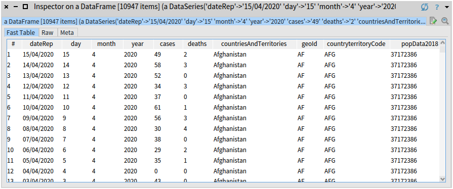

In this post, I show a small example of how we can analyse the data about the progression of COVID-19 using Pharo Data Frame.

## The Dataset of Live COVID-19 Updates

We will be working with the [daily-updated COVID-19 dataset](https://www.ecdc.europa.eu/en/publications-data/download-todays-data-geographic-distribution-covid-19-cases-worldwide) published by the European Centre for Disease Prevention and Control.

This dataset is a table with 10 columns:

- **dateRep** - date in the format `dd/mm/yyy`
- **day** - day of month (integer, range: 1-31)
- **month** - month number (integer, range: 1-12)
- **year** - four-digit year (integer, values: 2019, 2020)
- **cases** - number of cases reported on a given day in a given country 
- **deaths** - number of date reported on a given day in a given country
- **countriesAndTerritories** - country names, for example, `China`, `Germany`, `Ukraine`, `United_Kingdom`, and teritories taht belong to certain countries: `Saint Eustatius and Saba`, `United_States_Virgin_Islands`, etc. (206 unique values)
- **geoId** - two-letter country codes, for example, `CN`, `DE`, `UA`, `UK`. Note: for `Saint Eustatius and Saba` the value is empty and for `United_States_Virgin_Islands` it's `VI`. (206 unique values)
- **countryterritoryCode** - three-letter country codes, for example, `CHN`, `DEU`, `UKR`, `GBR`. Note: for `Saint Eustatius and Saba` the value is empty and for `United_States_Virgin_Islands` it's `VIR`. (202 unique values)
- **popData2018** - population of a given country as of 2018, taken from the [World Bank Open Data](https://data.worldbank.org/).

## Installing the DataFrame Library

Create a new [Pharo](https://pharo.org) image using Pharo Launcher. If you don't have Pharo installed, follow the instructions at [https://pharo.org/download](https://pharo.org/download).

In your new image, open a Playground (Ctrl+OW or Cmd+OW on Mac) and execute the following script (select it and press Do-it button or Ctrl+D): 

```Smalltalk
Metacello new
  baseline: 'CovidAnalysis';
  repository: 'github://olekscode/CovidAnalysis/src';
  load.
```

This will intall the [DataFrame](https://github.com/PolyMathOrg/DataFrame) library with all its dependencies.

## Downloading the Latest Data

In this section, I will explain how to dowload a file programmatically. It is fun and can be useful because this would allow you to automatically load the latest COVID-19 updates. You can skip this section and download today's dataset manually by following the link [https://opendata.ecdc.europa.eu/covid19/casedistribution/csv](https://opendata.ecdc.europa.eu/covid19/casedistribution/csv).

Pharo comes with many tools, one of them is [Zinc](https://ci.inria.fr/pharo-contribution/job/EnterprisePharoBook/lastSuccessfulBuild/artifact/book-result/Zinc-HTTP-Client/Zinc-HTTP-Client.html) - a simple, fast, and elegant HTTP client and server library. We will use it to make a GET request and download the latest COVID-19 dataset from this URL:

```Smalltalk
covidDatasetUrl := 'https://opendata.ecdc.europa.eu/covid19/casedistribution/csv'.
```

We create a Zinc client and specify the URL that will be accessed:

```Smalltalk
client := ZnClient new.
client url: covidDatasetUrl.
```

Now we make a GET request:

```Smalltalk
client get.
```

Response object will tell us the status of our request (if everything goes well, it should be 200 which means "Success"):

```Smalltalk
client response status. "200"
```

The dataset is a CSV file provided in binary form, so the contents of the HTTP response is a byte array:

```Smalltalk
bytes := client response entity bytes.
```

We will save them locally as a CSV file:

```Smalltalk
file := 'covidDataset.csv' asFileReference.

file binaryWriteStream
	nextPutAll: bytes;
	close.
```

This will create a `covidDataset.csv` file in the same directory where your Pharo image is located. You can find it using:

```Smalltalk
FileLocator imageDirectory asFileReference.
```

## Loading the CSV File Into a DataFrame

Now we will load the table from the downloaded CSV file into a DataFrame. Specify the path to your file:

```Smalltalk
covidCsv := 'covidDataset.csv' asFileReference.
```

Usually, you can load a CSV like that:

```Smalltalk
covid := DataFrame readFromCsv: covidCsv.
```

It will read the data as a table of strings, automatically detect the data type of each column (numbers, booleans, dates, etc.) and convert those strings to corresponding types. However, in this case, the `dateRep` column contains dates in a format that is not understood by Pharo: `dd/mm/yyyy` (Pharo understands either `dd.mm.yyyy` or `mm/dd/yyyy`). So it can not be parsed automatically.

This is a good exercise that will show you what can be done when you want to have a custom way of parsing values in your dataset. We will disable the automatic type inference, load everything as strings, and then convert the types of those columns manually in the next section.

First we create a custom CSV reader and configure it to disable type inference:

```Smalltalk
dataFrameReader := DataFrameCsvReader new.
dataFrameReader shouldInferTypes: false.
```

Then we use it to read the data:

```Smalltalk
covid := DataFrame
	readFrom: covidCsv
	using: dataFrameReader.
```

You can inspect this object by selecting the `covid` variable and pressing (Ctrl+I or Cmd+I on Mac). You will see a table like this:



## Cleaning the Data

The raw data that we loaded is big, messy, and hard to work with. Before jumping to data analysis, we have to clean this dataset, by ensuring the correctness of data types, removing columns that we don't need, renaming the remaining columns, etc.

### Removing Redundant Columns

The dataset that we have just loaded has too many columns:

```Smalltalk
covid columnNames.

"an OrderedCollection(
    'dateRep'
    'day'
    'month'
    'year'
    'cases'
    'deaths'
    'countriesAndTerritories'
    'geoId'
    'countryterritoryCode'
    'popData2018')"
```

Many of those columns are redundant and can be removed. For example, we do not need columns `day`, `month`, and `year` because they contain the same values as column `dateRep`. Similarly, we only need to keep one column to specify the country. We will use the `countriesAndTerritories` column which contains the full country name and remove the other two columns `geoId` and `countryterritoryCode` with country codes.

So we remove five columns:

```Smalltalk
covid removeColumns: #(day month year geoId countryterritoryCode).
```

### Renaming Columns

Names such as `countriesAndTerritories` or `popData2018` are long and hard to type. To make analysis easier, we rename some of the remaining columns to give them more verbose names:

```Smalltalk
covid
    renameColumn: 'dateRep' to: 'date';
    renameColumn: 'countriesAndTerritories' to: 'country';
    renameColumn: 'popData2018' to: 'population'.
```

### Parsing Date and Number Columns

```Smalltalk
covid
    toColumn: 'date'
    applyElementwise: [ :each |
        Date readFrom: each pattern: 'dd/mm/yyyy' ].
```

```Smalltalk
covid
    toColumns: #(cases deaths population)
    applyElementwise: [ :each |
        each
            ifNil: [ nil ]
            ifNotNil: [ each asInteger ] ].
```

### Sorting DataFrame by Date

```Smalltalk
covid sortBy: 'date'.
```

First create an instance of `CovidDataLoader`. This class will help you download the latest data from the Internet, clean it and load it into your image as a [DataFrame](https://github.com/PolyMathOrg/DataFrame) object.

```Smalltalk
dataLoader := CovidDataLoader new.
```

Use the following method to download the latest data. It may take a couple of seconds. The result will be stored as a CSV inside a `data/` folder of this repository.

```Smalltalk
dataLoader downloadLatestData.
```

Now you can read the downloaded data from a CSV. This method will automatically clean and parse the values of a dataset:

```Smalltalk
covidData := dataLoader loadData.
```

The result will be a data frame that looks like this:


### Example of Data Analysis

Let's find top 10 countries by the number of reported cases and number of reported deaths as of March 31, 2020:

```Smalltalk
(covidData group: 'cases' by: 'country' aggregateUsing: #sum)
	sortDescending
	head: 10.

(covidData group: 'deaths' by: 'country' aggregateUsing: #sum)
	sortDescending
	head: 10.
```


Now we will look at the historical data of how COVID-19 was spreading in one specific country, in this case - France:

```Smalltalk
covidDataFrance := covidData select: [ :row |
    (row at: 'country') = 'France' ].
```

Every row of this new data frame will have the same values in columns **country** and **population**. So we can remove those columns. But first, let's save the population of France in a separate variable, in case we need it later:

```Smalltalk
populationOfFrance := (covidDataFrance column: 'population') anyOne.

covidDataFrance removeColumns: #(country population).
```

We get the following data frame:


We can find the days on which there were the most reported cases and the most deaths in France:

```Smalltalk
maxDailyCases := (covidDataFrance column: 'cases') max. "4611"
maxDailyDeaths := (covidDataFrance column: 'deaths') max. "418"

covidDataFrance detect: [ :row | (row at: 'cases') = maxDailyCases ].
covidDataFrance detect: [ :row | (row at: 'deaths') = maxDailyDeaths ].
```


We can see that so far March 29 had the most reported cases - 4,611, and today, on March 31 there were the most deaths - 418 people died today in France.

Let's add two more columns: cumulative sum of cases and deaths. Cumulative sum tells us the total number of cases reported until the given date. For example, if there were 5 cases reported on Monday, no cases on Tuesday, and 12 cases on Wednesday, then the cumulative sum for those days will be 5 for Monday, 5 for Tuesday (5 + 0), and 17 for Wednesday (5 + 0 + 12).

```Smalltalk
cumulativeSum := [ :column |
    sum := 0.
    column collect: [ :each |
        sum := sum + each.
	sum ] ].

cumulativeCases := cumulativeSum value: (covidDataFrance column: 'cases').
cumulativeDeaths := cumulativeSum value: (covidDataFrance column: 'deaths').

covidDataFrance addColumn: cumulativeCases named: 'cumulativeCases'.
covidDataFrance addColumn: cumulativeDeaths named: 'cumulativeDeaths'.
```

Now `covidDataFrance` data frame looks like this: 


Let's find out how many days it took for disease to spread from 10 cases to 100 cases, as well as from 100 cases to 1000 cases. The following block will find the date in the given data frame on which the total number of reported cases reached the given number: 

```Smalltalk
findMilestone := [ :dataFrame :cases | 
    (dataFrame detect: [ :row | (row at: 'cumulativeCases') >= cases ]) at: 'date' ].
```

We find three milestones:

```Smalltalk
france10CasesMilestone := findMilestone value: covidDataFrance value: 10. "8 February 2020"
france100CasesMilestone := findMilestone value: covidDataFrance value: 100. "1 March 2020"
france1000CasesMilestone := findMilestone value: covidDataFrance value: 1000. "9 March 2020"
```

And calculate:

```Smalltalk
(france100CasesMilestone - france10CasesMilestone) days. "22"
(france1000CasesMilestone - france100CasesMilestone) days. "8"
```

So it took 22 days for COVID-19 to spread from 10 to 100 reported cases in France. And then only 8 more days to reach 1000 cases.
