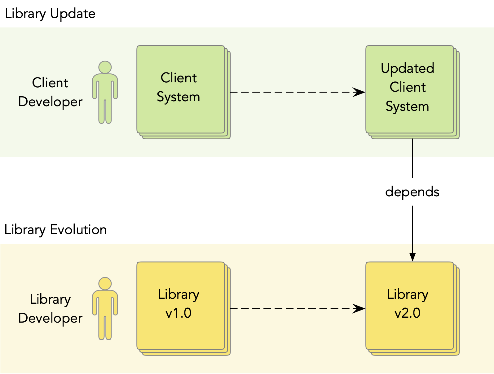
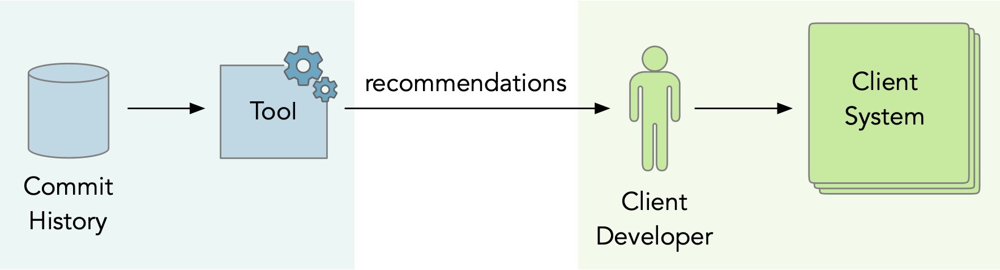
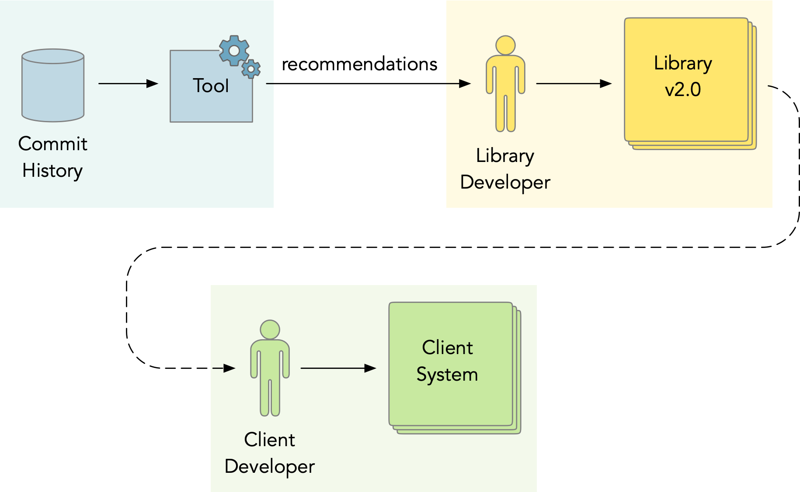
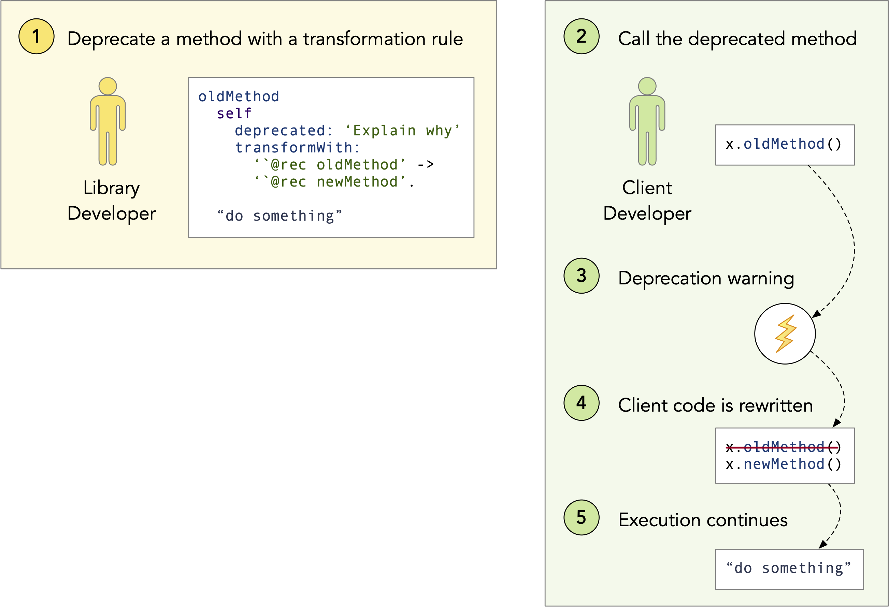
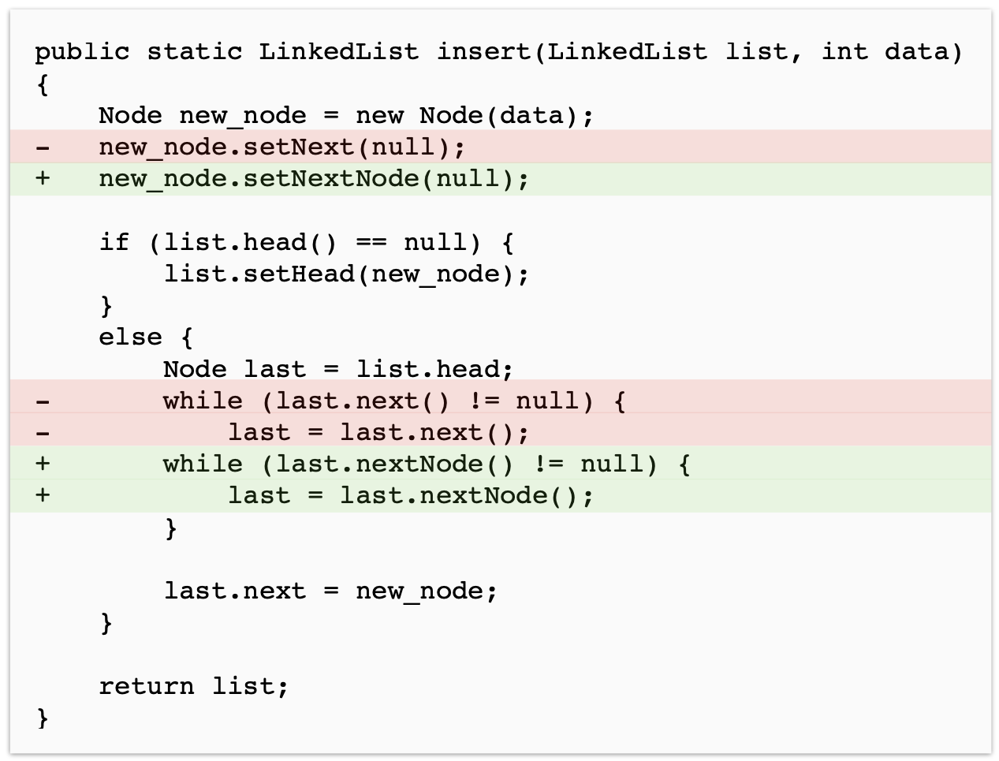
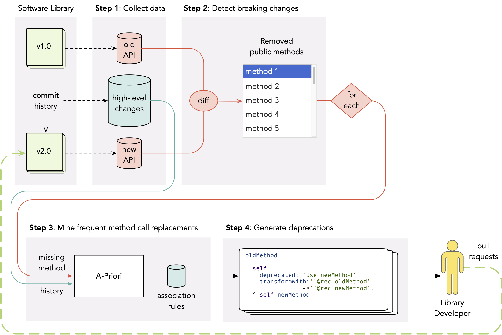
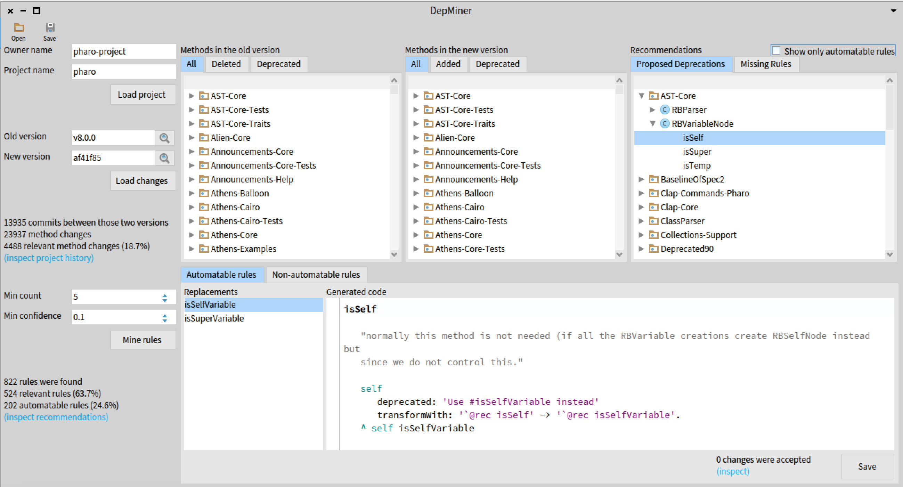

# DepMiner : Extraction de règles de transformation à partir de l’historique des validations

Dans ce blog, je présente la vulgarisation de notre article [DepMiner: Automatic Recommendation of Transformation Rules for Method Deprecation](https://link.springer.com/chapter/10.1007/978-3-031-08129-3_2). Cet article a été publié cette année à la [conférence internationale sur la réutilisation des logiciels](http://www.wikicfp.com/cfp/program?id=1481) (ICSR'22). Le [preprint gratuit de l'article](https://hal.archives-ouvertes.fr/hal-03647706/) peut être trouvé à HAL. Vous pouvez également regarder la [vidéo de ma présentation à ICSR](https://www.youtube.com/watch?v=7A3WhEkHX84&feature=youtu.be&ab_channel=OleksandrZaitsev) ou lire les [diapositives](https://www.slideshare.net/OleksandrZaytsev/depminer-automatic-recommendation-of-transformation-rules-for-method-deprecation).

## Le problème de la mise à jour des bibliothèques

Imaginez un scénario simple. Un développeur de logiciels, Bob, a créé une application qui dépend d'une bibliothèque externe. Après un certain temps, la bibliothèque publie une nouvelle version (que nous appelons _évolution de la bibliothèque_), qui n'est plus compatible avec la précédente. Bob a maintenant deux options : soit il met à jour la dépendance vers sa dernière version, soit il s'en tient à l'ancienne. Bob décide de mettre à jour, parce qu'il veut utiliser les nouvelles fonctionnalités et parce qu'il a peur qu'au bout d'un moment, la bibliothèque cesse de supporter son ancienne version et qu'il ait des problèmes (par exemple, des failles de sécurité). Mais lorsque Bob change la version de sa dépendance, il obtient de multiples erreurs. Cela se produit parce que la bibliothèque n'est plus compatible avec sa version précédente, elle contient des _changements de rupture_.

Afin de passer à la nouvelle version d'une bibliothèque externe, Bob doit modifier son application. Il doit comprendre quelles parties de l'interface de programmation d'application (API) ont été affectées par l'évolution de la bibliothèque et comment il doit modifier le code de son application pour qu'elle fonctionne avec la nouvelle version. C'est ce que l'on appelle le problème de la _mise à jour des bibliothèques_. Il s'agit d'un problème important dans le domaine de la recherche sur la réutilisation des logiciels.

Dans l'image ci-dessous, vous pouvez voir une visualisation simple du processus que je viens de décrire. Ici, Bob est le développeur du client et son application est le système client. Le système client est mis à jour à la nouvelle version en réponse à l'évolution de la bibliothèque qui est maintenue par les développeurs de la bibliothèque.



## Le point de vue des développeurs de bibliothèques

De multiples approches ont été proposées pour aider les **développeurs clients** à gérer la mise à jour des bibliothèques. La plupart de ces approches sont basées sur l'exploration de l'historique des validations ou l'analyse du code source afin d'extraire la connaissance du système et de la présenter au client sous forme de recommandations ou de règles automatiques.



Nous proposons de changer de perspective et de proposer des recommandations aux **développeurs de bibliothèques**, qui possèdent déjà certaines connaissances sur le système mais qui peuvent avoir besoin d'aide pour en comprendre différentes parties, se souvenir des modifications apportées il y a longtemps ou comprendre les modifications apportées par d'autres. Les développeurs de bibliothèques sont motivés pour aider leurs clients car ils veulent qu'ils mettent à jour leurs applications avec les dernières versions. Ainsi, dans notre modèle, nous exploitons l'historique des validations pour aider les développeurs de bibliothèques à préparer une meilleure version (c'est-à-dire avec moins de changements de rupture et mieux documentée). De cette façon, les développeurs de bibliothèques peuvent aider leurs clients à mettre à jour.



Les développeurs de bibliothèques peuvent soutenir leurs clients de quatre manières principales :

1. **Documentation** -- notes de version, journaux des modifications, tutoriels, etc.
2. **Dépréciation** -- marquer de la fonctionnalité comme "dépréciée" au lieu de la supprimer immédiatement.
3. **Automatisation** -- script de mise à jour, règles de transformation, etc.
4. **Communication** -- chats, forums, listes de diffusion, etc.

Dans ce travail, nous nous concentrons sur deux de ces stratégies : la dépréciation et l'automatisation. Nous proposons une approche pour exploiter l'historique des validations d'une bibliothèque et générer des dépréciations de méthodes avec des règles de transformation qui peuvent être utilisées pour corriger automatiquement le code du client.

## Deprewriter : Déprécations transformantes dans Pharo

Dans Pharo, il existe une technique puissante des dépréciations transformantes appelée Deprewriter. Elle permet aux développeurs de bibliothèques de déprécier des méthodes avec des règles de transformation qui seront utilisées pour réécrire automatiquement le site d'appel dans le code client chaque fois que la méthode dépréciée est appelée. Dans cette section, je vais brièvement expliquer cette technique. Pour une explication plus détaillée, veuillez lire mon [blog sur Deprewriter](https://www.arolla.fr/blog/2021/09/deprewriter-depreciations-intelligentes-pour-la-correction-automatique-de-code-client/) ou notre article [Deprewriter : On the fly rewriting method deprecations](https://hal.inria.fr/hal-03563605) qui a été publié dans le Journal of Object Technologies.

Ci-dessous, vous pouvez voir un exemple de la façon dont une méthode `Collection.includesAllOf()` peut être dépréciée avec une règle de  transformation qui la remplace par `newMethod`:

```Smalltalk
Collection >> includesAllOf: values
  self
    deprecated: ‘Use includesAll: instead’
    transformWith: ‘`@rec includesAllOf: `@arg’ -> ‘`@rec includesAll: `@arg’.

  ^ self includesAll: valuesSmalltalk
```

Pour déprécier une méthode dans Pharo, on appelle une méthode `deprecated:transformWith:` avec deux arguments :

1. Une chaîne qui sera affichée au client dans un avertissement de dépréciation. Dans ce cas, `'Use includesAll : instead'` - un message informant les clients de ce qui est un bon remplacement pour la méthode dépréciée (comme nous le verrons plus tard, de nombreuses dépréciations n'ont pas de message utile).
2. Une règle de transformation de la forme `antécédent -> conséquent`. Où _antécédent_ est une expression de gauche, correspondant à l'appel de méthode qui doit être réécrit (dans notre exemple, c'est `'@rec includesAllOf : '@arg`), et _conséquent_ est l'expression de droite définissant le remplacement (dans notre exemple, c'est `'@rec includesAll : '@arg`).

Lorsque le système client fait un appel à la méthode dépréciée, Deprewriter trouve ce site d'appel spécifique, utilise la règle de transformation pour le réécrire, puis poursuit l'exécution comme si de rien n'était. Vous pouvez voir l'illustration de ce processus dans l'image ci-dessous.



## Pourquoi avons-nous encore besoin de soutenir les développeurs de bibliothèques ?

Bien qu'ils disposent de bons outils pour la dépréciation des méthodes, les développeurs de bibliothèques manquent souvent l'occasion de déprécier (ils suppriment des méthodes sans les déprécier au préalable, ce qui casse l'API) ou manquent l'occasion d'introduire une règle de transformation alors qu'elle est simple. Parfois, ils le font exprès, par exemple s'ils pensent que les dépréciations vont augmenter la complexité de la maintenance du système.

Mais dans de nombreux cas, cela se produit parce que les développeurs de bibliothèques ne peuvent pas suivre tous les changements qui se produisent dans la bibliothèque (en particulier dans les grands projets open-source). Des méthodes sont supprimées, renommées, divisées, etc., sans que personne ne se rende compte que cela peut perturber les clients. De plus, il arrive que les développeurs de bibliothèques ne sachent pas quel est le bon remplacement pour la méthode supprimée.

Des études empiriques montrent qu'environ 33% des dépréciations en Java et JavaScript, ainsi que 22% des dépréciations en C#, ne comportent aucun message de remplacement utile qui suggérerait aux clients comment remplacer la méthode obsolète. Nous avons également analysé les dépréciations de méthodes dans Pharo 8 et montré que 41 % d'entre elles ne sont pas transformantes (elles ne contiennent pas de règle de transformation). Ce qui est intéressant, c'est qu'environ 22% de ces dépréciations non-transformantes pourraient être facilement (et parfois automatiquement) fournies avec une règle de transformation. Cela indique que soit les développeurs de bibliothèques ne savaient pas comment écrire des règles de transformation, soit ils ne savaient pas pourquoi la méthode a été supprimée et quel est son remplacement (par exemple, si le développeur A a renommé une méthode et que 100 jours plus tard le développeur B a remarqué qu'elle casse certains clients et a décidé de réintroduire l'ancienne méthode avec une dépréciation).

Dans les deux cas, les développeurs de bibliothèques pourraient bénéficier d'outils automatisés qui analyseraient le code source de la bibliothèque avant la publication pour identifier les changements de rupture (c'est-à-dire les méthodes publiques manquantes) et exploiteraient l'historique des validations pour les expliquer et trouver des remplacements.

## Idée générale : Extraction de remplacements fréquents d'appels de méthodes

Notre approche est basée sur une technique d'exploration de données appelée _l'analyse du panier de la ménagère_. Elle permet de découvrir des associations entre des produits qui sont couramment achetés ensemble. Par exemple, l'algorithme d'analyse du panier de la ménagère, tel que A-Priori, Eclat ou FP-Growth, peut nous dire que le pain et le beurre sont souvent achetés ensemble. Ou que les clients qui achètent des céréales sont également susceptibles d'acheter du lait.

Pour répondre à ces questions, nous commençons par collecter un ensemble de données sur les transactions. Par exemple, un ensemble de produits qui ont été achetés par chaque client :

```
Client 1 : { pain, beurre, bananes }
Client 2 : { pain, beurre, avocat }
Client 3 : { pain, beurre, lait, céréales }
Client 4 : { pain, lait, céréales }
Client 5 : { beurre, lait, céréales }
```

(les ensembles de données réels peuvent contenir des milliards de transactions)

Ensuite, nous utilisons une méthode efficace d'énumération et de comptage des sous-ensembles d'articles pour trouver les paires de produits qui ont été achetées ensemble par au moins 60% des clients (c'est ce qu'on appelle le _seuil de soutien_). L'algorithme trouvera deux paires d'articles qui satisfont au seuil de soutien : { pain, beurre } et { lait, céréales }. En effet, dans notre jeu de données, ces paires d'articles sont achetées ensemble par 3 clients sur 5. Ces sous-ensembles d'articles sont appelés les _ensembles d'articles fréquents_.

Ensuite, nous pouvons essayer de répondre à la question de savoir quels sont les produits que les clients achètent souvent avec du pain. Nous pouvons voir que 4 clients ont acheté du pain et que 3 d'entre eux (75%) ont également acheté du beurre. Cela signifie que nous pouvons recommander du beurre à tous les clients qui achètent du pain et nous attendre à ce que cette recommandation soit pertinente pour eux dans 75% des cas (nous appelons ce chiffre la _confiance_). Dans ce cas, { pain } -> { beurre } est appelée une _règle d'association_. Compte tenu du _seuil de confiance_, l'algorithme d'exploration de données peut extraire ce type de règles des données.

Nous pouvons appliquer une technique similaire à l'historique des validations. Pour ce faire, nous construisons un ensemble de données de transactions, où chaque transaction est un _changement de méthode_ (une méthode modifiée par un commit), représenté comme un ensemble d'appels de méthode ajoutés et supprimés. Par exemple, voici un changement de méthode - méthode `insert()` modifiée par un commit :



Nous pouvons représenter ce changement de méthode comme un ensemble d'appels de méthode ajoutés et supprimés :

```
{
  supprimer(setNext),
  ajouter(setNextNode),
  supprimer(next),
  supprimer(next),
  ajouter(nextNode),
  ajouter(nextNode)
}
```

Ainsi, après avoir construit un ensemble de données de transactions à partir de l'historique des validations, nous pouvons l'utiliser pour extraire des sous-ensembles fréquents d'ajouts et de suppressions d'appels de méthodes tels que `{ supprimer(next), ajouter(nextNode) }` et les utiliser pour déduire les règles d'association que nous appelons des remplacements fréquents d'appels de méthodes : `{ next } -> { nextNode }`.

Notre logique est la suivante : lorsque la méthode next de la bibliothèque a été renommée `nextNode`, chaque référence à cette méthode a dû être mise à jour. Par conséquent, dans l'historique des validations, il devrait y avoir un modèle selon lequel l'appel à la méthode `next` a souvent été supprimé et en même temps l'appel à la méthode `nextNode` a été ajouté.

Après avoir collecté la liste des règles d'association (remplacements fréquents d'appel de méthode), il est simple de générer des dépréciations. Par exemple :

```Smalltalk
next
  self
    deprecated: 'Use nextNode instead'
    transformWith: '`@rec next' -> '`@rec nextNode'.
   
  ^ self nextNode.
```

Maintenant, nous pouvons signaler au développeur de la bibliothèque que la méthode publique next est manquante, ce qui constitue un changement de rupture qui peut affecter les clients, et recommander de réintroduire cette méthode avec la dépréciation de réécriture.

Le schéma étape par étape de notre approche peut être vu dans l'image ci-dessous.



## Évaluation

Pour évaluer notre approche, nous l'avons implémentée dans un outil prototype pour Pharo. Notre outil présentait aux développeurs de bibliothèques la liste des méthodes publiques dans l'ancienne et la nouvelle version de leur projet, ainsi que la liste des changements de rupture. Lorsque cela était possible, le changement de rupture était accompagné d'une recommandation suggérant un remplacement et d'une règle de transformation générée. Les développeurs pouvaient voir quels commits dans l'historique avaient contribué à cette recommandation. Ensuite, ils pouvaient accepter ou rejeter la dépréciation. Voici la capture d'écran de ce prototype d'outil.



Nous avons appliqué notre outil à 5 projets open-source de taille et de type différents : outils, bibliothèques et SDK. 134 des dépréciations générées ont été acceptées dans les projets en tant que pull requests.

(pour plus d'informations sur l'évaluation, veuillez consulter notre article).

## Conclusion

- Dans notre article, nous avons proposé une approche pour aider les développeurs de bibliothèques à améliorer leurs versions en générant des dépréciations avec des règles de transformation.
- Ces dépréciations peuvent être utilisées pour réécrire le code client.
- Notre approche est basée sur le remplacement fréquent d'appels de méthode à partir de l'historique des validations.
- Nous avons implémenté notre approche comme un outil prototype pour Pharo et l'avons évalué sur 5 projets open-source.
- 134 des dépréciations générées ont été acceptées dans les projets en tant que pull requests.

