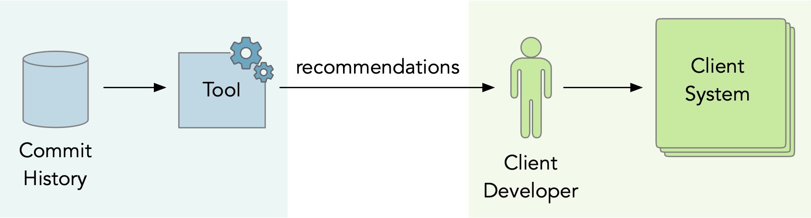
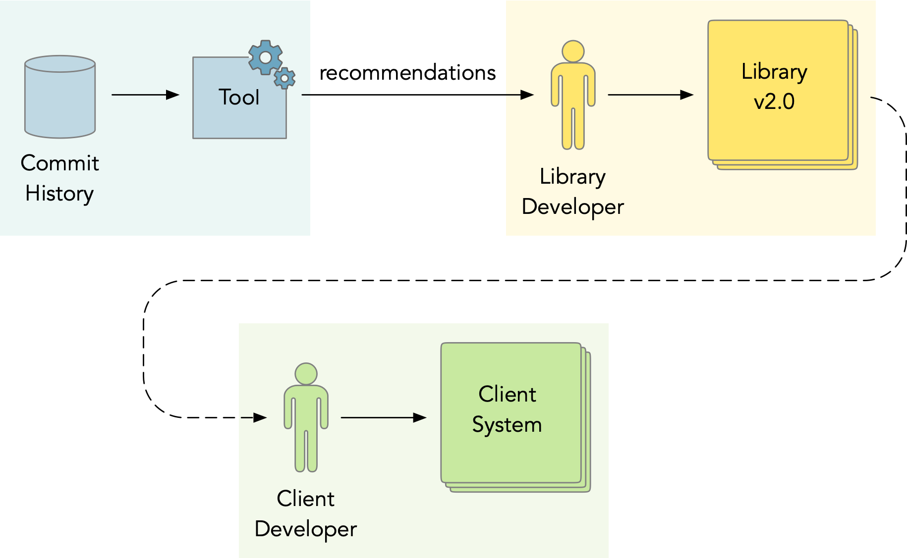
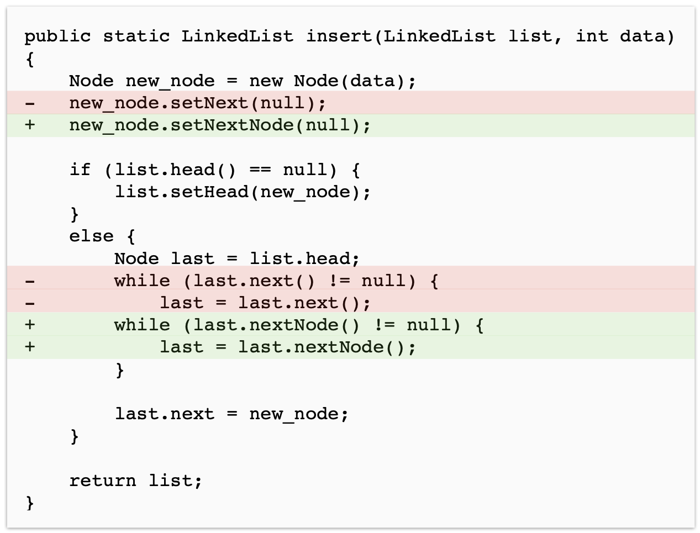

# DepMiner: Mining Transformation Rules from the Commit History

In this blog post, I present the vulgarization of our paper [DepMiner: Automatic Recommendation of Transformation Rules for Method Deprecation](https://link.springer.com/chapter/10.1007/978-3-031-08129-3_2).
It was published this year at the [International Conference on Software Reuse](http://www.wikicfp.com/cfp/program?id=1481) (ICSR'22).
The [free preprint of the paper](https://hal.archives-ouvertes.fr/hal-03647706/) can be found at HAL.
You can also watch the [video of my presentation at ICSR](https://youtu.be/7A3WhEkHX84) or read the [slides](https://www.slideshare.net/OleksandrZaytsev/depminer-automatic-recommendation-of-transformation-rules-for-method-deprecation).

## The Problem of Library Update

Imagine a simple scenario.
A software developer Bob created an application that depends on an external library.
After some time, the library releases a new version (we call this _library evolution_), which is no longer compatible with the previous one.
Now Bob has two options: either to update the dependency to its latest version or stick with the old one.
Bob decides to update, because he wants to use the fancy new features and because he is afraid that after a while the library will stop supporting its old version and he will have troubles (e.g., security vulnerabilities).
But when Bob changes the version of his dependency, he gets multiple errors.
This happens because the library is no longer compatible with its previous version, it contains breaking changes.

In order to update to the new version of an external library, Bob must change his application accordingly.
He must understand, which parts of the Application Programming Interface (API) were affected by the library evolution and how must he modify the code of his application to run in with the new version.
This is known as the problem of _library update_. 
It is an important problem in the field of software reuse research.

In the picture below, you can see a simple visualization of the process that we have just discussed.
Here, Bob is the _client developer_ and his application is the _client system_.
The client system is updated to the new version in response to the evolution of library that is maintained by the _library developers_.


## Library Developer Perspective

Multiple approaches have been proposed to help client developers deal with library update.
Most of those approaches are based on mining the commit history or analysing the source code in order to extract the knowledge about the system and then present it to the client in the form of recommendations or automatable rules.



We propose to switch the perspective and to propose recommendations to library developers, who already possess some knowledge about the system but might need help understanding different parts of it, remembering the changes that were made long time ago, or understanding the changes that were made by others.
Library developers are motivated to support their clients because they want them to update their applications to the latest versions.
So, in our model, we mine the commit hitory to help library developers to prepare a better release (i.e. with less breaking changes and better documented).
And this way, library developers can help their clients to update.



There are four main ways how library developers can support their clients:

1. **Documentation** -- release notes, change logs, tutorials, etc.
2. **Deprecation** -- labeling functionality as "deprecated" instead of removing it right away.
3. **Automation** -- update script, transformation rules, etc.
4. **Communication** -- chats, forums, mailing lists, etc.

In this work, we focus on two of those strategies - deprecation and automation.
We propose an approach to mine the commit history of a library and generate method deperecations with transformation rules that can be used to automatically fix client code.

## Deprewriter: Rewriting Deprecations in Pharo

In Pharo, there is a powerful technique of rewriting deprecations called _Deprewriter_.
It allows library developers to deprecate methods with transformation rules that will be used to automatically rewrite the call-site in the client code whenever the deprecated method is being called.
In this section, I will briefly explain this technique.
For more detailed explanation, please read my [blog post about Deprewriter](https://www.arolla.fr/blog/2021/09/deprewriter-depreciations-intelligentes-pour-la-correction-automatique-de-code-client/) or our paper [Deprewriter: On the fly rewriting method deprecations](https://hal.inria.fr/hal-03563605) that was published in the Journal of Object Technologies.

Below, you can see an example of how a method `Collection.includesAllOf()` can be deprecated with a transformation that replaces it with `newMethod`.

```Smalltalk
Collection >> includesAllOf: values
  self
    deprecated: ‘Use includesAll: instead’
    transformWith: ‘`@rec includesAllOf: `@arg’ -> ‘`@rec includesAll: `@arg’.

  ^ self includesAll: values
```

To deprecate a method in Pharo, we call a method `deprecated:transformWith:` with two arguments:

1. A string that will be displayed to the client in a deprecation warning. In this case, `‘Use includesAll: instead’` - a message informing clients what is the good replacement for the deprecated method (as we will see later, many deprecations do not have any helpful message).
2. A transformation rule in the form `antecedent -> consequent`. Where _antecedent_ is a left-hand side expression, matching the method call the should be rewritten (in our example, it's `'@rec includesAllOf: '@arg`), and _consequent_ is the right-hand side expression defining the replacement (in our example, it's `'@rec includesAll: '@arg`).

When client system makes a call to the deprecated method, Deprewriter will find that specific call site, use the transformation rule to rewrite it, and then continue the execution as if nothing happened. You can see the illustration of this process in the picture below.


## Why Do We Still Need to Support Library Developers?

Despite having good tools for method deprecation, library developers often miss the deprecation opportunity (they remove methods without deprecating them first thus breaking the API) or miss the chance to introduce a transformation rule when it is straightforward.
Sometimes they do it on purpose, for example if they think that deprecations will increase the complexity of maintaining the system.

But in many cases, it happens because library developers can not keep track of all the changes that happen in the library (especially in large open-source projects).
Methods get removed, renamed, split, etc., without anyone noticing that this may break clients.
Also, there are cases when library developers do not know what is the good replacement for the removed method.

Empirical studies show that about 33% of deprecations in Java and JavaScript, as well as 22% of deprecations in C#, do not have any helpful replacement message that would suggest clients how to replace the obsolete method.
We have also analysed method deprecations in Pharo 8 and show that 41% of them are non-rewriting (do not contain a transformation rule).
What's interesting is that about 22% of those non-rewriting deprecations could be easily (and sometimes automatically) supplied with a transformation rule.
This indicates that either library developers did not know how to write transformation rules, or they did not know why the method was removed and what is the replacement for it (i.e., if developer A renamed a method and 100 days later developer B noticed that it breaks some clients and decided to re-introduce the old method with deprecation).

In both cases, library developers could benefit from the automated tools that would analyse the source code of the library before the release to identify breaking changes (i.e. missing public methods) and mine the commit history to explain them and find replacements.


## General Idea: Mining Frequent Method Call Replacements

Our approach is based on the data mining technique called the _market basket analysis_.
It helps uncover associations between products that are commonly purchased together.
For example, the algorithm of market basket analysis, such as A-Priori, Eclat, or FP-Growth, can tell us that _bread_ and _butter_ are often purchased together.
Or that the customers who buy cereals are also likely to buy milk.

To answer those questions, we start by collecting a dataset of transactions.
For example, a set of products that were purchased by each customer:

```
Customer 1: { bread, butter, bananas }
Customer 2: { bread, butter, avocado }
Customer 3: { bread, butter, milk, cereal }
Customer 4: { bread, milk, cereal }
Customer 5: { butter, milk, cereal }
```
(real datasets may contain billions of transactions)

Then we use an efficient way of enumerating and counting the subsets of items to find which pairs of products were bought together by at least 60% of customers (this is called the _support threshold_).
The algorithm will find two pairs of items that sattisfy the support threshold: `{ bread, butter }` and `{ milk, cereal }`.
Indeed, in our dataset, those pairs of items are purchased together by 3 out of 5 customers.
Those subsets of items are called the _frequent itemsets_.

Next, we can try to answer what are the products that the customers often buy together with bread.
We can see that there are 4 customers who bought bread and 3 of them (75%) have also bought butter.
This means that we can recommend butter to all customers who buy bread and expect that this recommendation will be relevant for them in 75% of cases.
In this case, `{ bread } -> { butter }` is called an association rule.
Given the confidence threshold, the data mining algorithm can retrive those kind of rules from the data.

We can apply a similar technique to the commit history.
To do that, we build a transaction dataset, where each transaction is a method change (one method modified by one commit), represented as a set of added and removed method calls.
For example, here is a method change - method `insert()` modified by a commit:



We can represent this method change as a set of added and removed method calls:

```
{
  remove(setNext),
  add(setNextNode),
  remove(next),
  remove(next),
  add(nextNode),
  add(nextNode)
}
```

This way, after building a dataset of transactions from the commit history, we can use it tmine frequent subsets of method call additions removals such as `{ remove(next), add(nextNode) }` and use them to infer the association rules which we call _frequent method call replacements_: `{ next } -> { nextNode }`.

Our logic is the following: when method `next` in the library was renamed to `nextNode`, every reference to that method had to be updated.
Therefore, in the commit history there should be a pattern that method call to `next` was often removed and at the same time the method call to `nextNode` was added.

After collecting the list of association rules (frequent method call replacements), it is straightforward to generate deprecations. For example:

```Smalltalk
next
  self
    deprecated: 'Use nextNode instead'
    transformWith: '`@rec next' -> '`@rec nextNode'.
   
  ^ self nextNode.
```

Now we can report to library developer that public method `next` is missing, which is a breaking change that may affect clients, and recommend to reintroduce this method with the rewriting deprecation.

The step-by-step outline of our approach can be seen in the picture below. 


## Evaluation

To evaluate our approach, we implemented it in a prototype tool for Pharo.
Our tool presented library developers with the list of public methods in both the old and the new version of their project, as well as the list of breaking changes.
Where possible, the breaking change was accompanied with recommendation that suggested a replacement and a generated transformation rule.
Developers could see which commits in the history contributed to this recommendation.
After that, they could accept or reject the deprecation.
Here is the screenshot of this prototype tool.


We applied our tool to 5 open-source projects of different size and type: tools, libraries and SDKs.
134 of the generated deprecations were accepted into the projects as pull requests.

(for more information about the evaluation, please see the paper).

## Conclusion

- In our paper, we proposed an approach to help library developers improve their releases by generating deprecations with transformation rules.
- Those deprecations can be used to rewrite client code.
- Our approach is based on frequent method call replacement from the commit history.
- We implemented our approach as a prototype tool for Pharo and evaluated it on 5 open-source projects.
- 134 of the generated deprecations were accepted into the projects as pull requests.