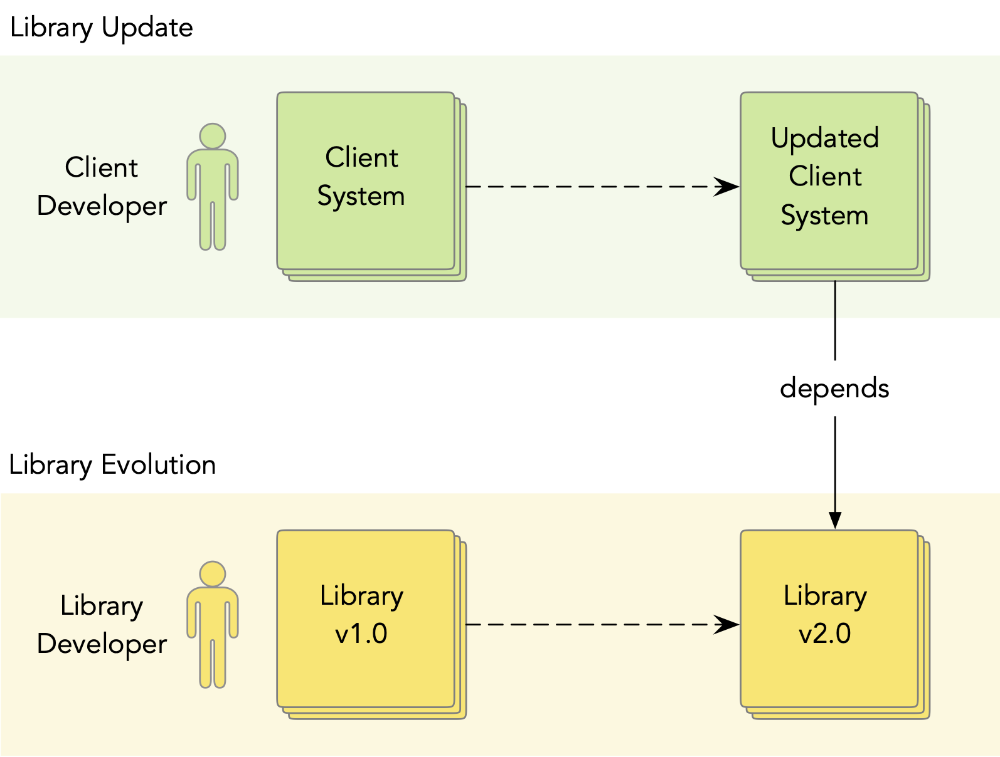
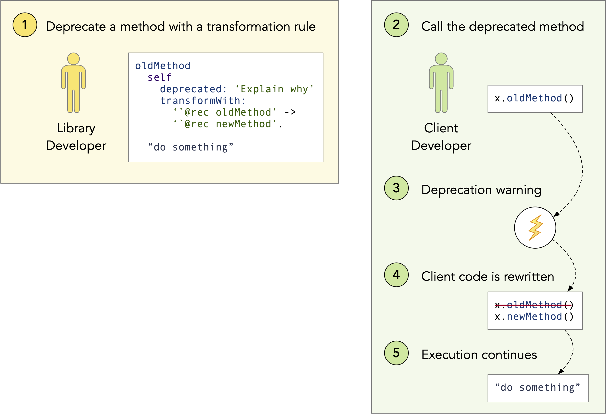
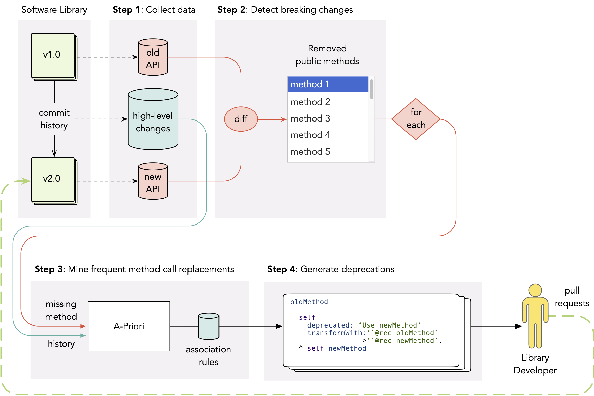
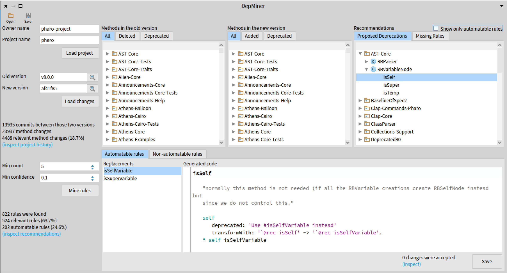

# Mining Transformation Rules from the Commit History

In this blog post, I present the vulgarization of our paper [DepMiner: Automatic Recommendation of Transformation Rules for Method Deprecation](https://link.springer.com/chapter/10.1007/978-3-031-08129-3_2).
It was published this year at the [International Conference on Software Reuse](http://www.wikicfp.com/cfp/program?id=1481) (ICSR'22).
The [free preprint of the paper](https://hal.archives-ouvertes.fr/hal-03647706/) can be found at HAL.
You can also watch the [video of my presentation at ICSR](https://youtu.be/7A3WhEkHX84) or read the [slides](https://www.slideshare.net/OleksandrZaytsev/depminer-automatic-recommendation-of-transformation-rules-for-method-deprecation).

## The Problem of Library Update

Imagine a simple scenario.
A software developer Bob created an application that depends on an external library.
After some time, the library releases a new version (we call this _library evolution_), which is no longer compatible with the previous one.
Now Bob has two options: either to update the dependency to its latest version or stick with the old one.
Bob decides to update, because he wants to use the fancy new features and because he is afraid that after a while the library will stop supporting its old version and he will have troubles (e.g., security vulnerabilities).
But when Bob changes the version of his dependency, he gets multiple errors.
This happens because the library is no longer compatible with its previous version, it contains breaking changes.

In order to update to the new version of an external library, Bob must change his application accordingly.
He must understand, which parts of the Application Programming Interface (API) were affected by the library evolution and how must he modify the code of his application to run in with the new version.
This is known as the problem of _library update_. 
It is an important problem in the field of software reuse research.

In the picture below, you can see a simple visualization of the process that we have just discussed.
Here, Bob is the _client developer_ and his application is the _client system_.
The client system is updated to the new version in response to the evolution of library that is maintained by the _library developers_.

## Library Developer Perspective

Multiple approaches have been proposed to help client developers deal with library update.
Most of those approaches are based on mining the commit history or analysing the source code in order to extract the knowledge about the system and then present it to the client in the form of recommendations or automatable rules.

We propose to switch the perspective and to propose recommendations to library developers, who already possess some knowledge about the system but might need help understanding different parts of it, remembering the changes that were made long time ago, or understanding the changes that were made by others.
Library developers are motivated to support their clients because they want them to update their applications to the latest versions.
So, in our model, we mine the commit hitory to help library developers to prepare a better release (i.e. with less breaking changes and better documented).
And this way, library developers can help their clients to update.

## Deprewriter: Rewriting Deprecations in Pharo

## Why Do We Still Need to Support Library Developers?

## General Idea: Mining Frequent Method Call Replacements

## Depminer: Outine of Our Approach

## Evaluation

## Conclusion