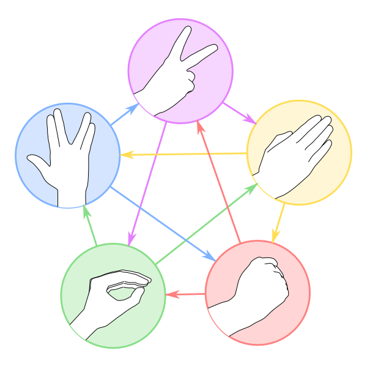
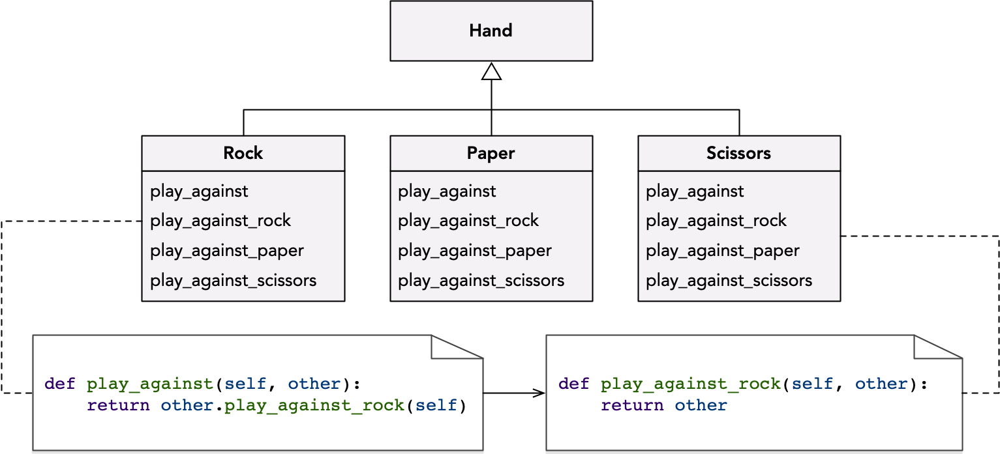

# Design Coffee Club: Double Dispatch

Today at our weekly Desigm Coffee Club meeting at [RMoD](https://rmod.inria.fr), we discussed double dispatch - a process to choose which method to invoke depending on the receiver and the argument type.

## Rock-Paper-Scissors Game


```Python
def play_rock_paper_scissors(first_hand, second_hand):
    if (first_hand == 'Rock'):
        if (second_hand == 'Rock'):
            return 'Draw'
        elif (second_hand == 'Paper'):
            return 'Paper'
        else:
            return 'Rock'
    elif (first_hand == 'Paper'):
        if (second_hand == 'Rock'):
            return 'Paper'
        elif (second_hand == 'Paper'):
            return 'Draw'
        else:
            return 'Scissors'
    else:
        if (second_hand == 'Rock'):
            return 'Rock'
        elif (second_hand == 'Paper'):
            return 'Scissors'
        else:
            return 'Draw'

```

## Problem: Adding Lizard and Spock

[The Big Bang Theory, Season 2 Ep. 5, "The Lizard-Spock Expansion"](https://youtu.be/Kov2G0GouBw)

- Scissors cuts Paper
- Paper covers Rock
- Rock crushes Lizard
- Lizard poisons Spock
- Spock smashes Scissors
- Scissors decapitates Lizard
- Lizard eats Paper
- Paper disproves Spock
- Spock vaporizes Rock
- (and as it always has) Rock crushes Scissors



```Python
def play_rock_paper_scissors_lizard_spock(first_hand, second_hand):
    if (first_hand == 'Rock'):
        if (second_hand == 'Rock'):
            return 'Draw'
        elif (second_hand == 'Paper'):
            return 'Paper'
        elif (second_hand == 'Scissors'):
            return 'Rock'
        elif (second_hand == 'Lizard'):
            return 'Rock'
        else:
            return 'Spock'
    elif (first_hand == 'Paper'):
        if (second_hand == 'Rock'):
            return 'Paper'
        elif (second_hand == 'Paper'):
            return 'Draw'
        elif (second_hand == 'Scissors'):
            return 'Scissors'
        elif (second_hand == 'Lizard'):
            return 'Lizard'
        else:
            return 'Paper'
    elif (first_hand == 'Scissors'):
        if (second_hand == 'Rock'):
            return 'Rock'
        elif (second_hand == 'Paper'):
            return 'Scissors'
        elif (second_hand == 'Scissors'):
            return 'Draw'
        elif (second_hand == 'Lizard'):
            return 'Scissors'
        else:
            return 'Spock'
    elif (first_hand == 'Lizard'):
        if (second_hand == 'Rock'):
            return 'Rock'
        elif (second_hand == 'Paper'):
            return 'Lizard'
        elif (second_hand == 'Scissors'):
            return 'Scissors'
        elif (second_hand == 'Lizard'):
            return 'Draw'
        else:
            return 'Lizard'
    else:
        if (second_hand == 'Rock'):
            return 'Spock'
        elif (second_hand == 'Paper'):
            return 'Paper'
        elif (second_hand == 'Scissors'):
            return 'Spock'
        elif (second_hand == 'Lizard'):
            return 'Lizard'
        else:
            return 'Draw'

```

## Better Implementation Using Double Dispatch

```Python
class Hand:
    def is_rock(self):
        return False
        
    def is_paper(self):
        return False
        
    def is_scissors(self):
        return False
        
    def is_draw(self):
        return False
```
```Python   
class Draw(Hand):
    def is_draw(self):
        return True
```
```Python
class Rock(Hand):
    def is_rock(self):
        return True
                
    def play_against(self, other):
        return other.play_against_rock(self)
    
    def play_against_rock(self, other):
        return Draw()
        
    def play_against_paper(self, other):
        return other
        
    def play_against_scissors(self, other):
        return self
```
```Python
class Paper(Hand):
    def is_paper(self):
        return True
                
    def play_against(self, other):
        return other.play_against_paper(self)
    
    def play_against_rock(self, other):
        return self
        
    def play_against_paper(self, other):
        return Draw()
        
    def play_against_scissors(self, other):
        return other
```
```Python
class Scissors(Hand):
    def is_scissors(self):
        return True
                
    def play_against(self, other):
        return other.play_against_scissors(self)
    
    def play_against_rock(self, other):
        return other
        
    def play_against_paper(self, other):
        return self
        
    def play_against_scissors(self, other):
        return Draw()
```



