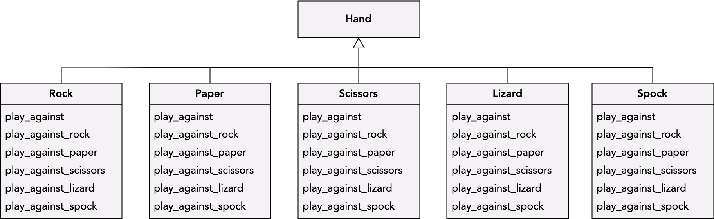

# Design Coffee Club: Double Dispatch

Today at our weekly Desigm Coffee Club meeting at RMoD, we discussed double dispatch - a process to choose which method to invoke depending on the receiver and the argument type.

## Rock-Paper-Scissors Game

```Python
def play_rock_paper_scissors(first_hand, second_hand):
    if (first_hand == 'Rock'):
        if (second_hand == 'Rock'):
            return 'Draw'
        elif (second_hand == 'Paper'):
            return 'Paper'
        else:
            return 'Rock'
    elif (first_hand == 'Paper'):
        if (second_hand == 'Rock'):
            return 'Paper'
        elif (second_hand == 'Paper'):
            return 'Draw'
        else:
            return 'Scissors'
    else:
        if (second_hand == 'Rock'):
            return 'Rock'
        elif (second_hand == 'Paper'):
            return 'Scissors'
        else:
            return 'Draw'

```

```Python
class Hand:
    def is_rock(self):
        return False
        
    def is_paper(self):
        return False
        
    def is_scissors(self):
        return False
        
    def is_draw(self):
        return False
        
        
class Draw(Hand):
    def is_draw(self):
        return True
        

class Rock(Hand):
    def is_rock(self):
        return True
                
    def play_against(self, other):
        return other.play_against_rock(self)
    
    def play_against_rock(self, other):
        return Draw()
        
    def play_against_paper(self, other):
        return other
        
    def play_against_scissors(self, other):
        return self
        
        
class Paper(Hand):
    def is_paper(self):
        return True
                
    def play_against(self, other):
        return other.play_against_paper(self)
    
    def play_against_rock(self, other):
        return self
        
    def play_against_paper(self, other):
        return Draw()
        
    def play_against_scissors(self, other):
        return other
        
        
class Scissors(Hand):
    def is_scissors(self):
        return True
                
    def play_against(self, other):
        return other.play_against_scissors(self)
    
    def play_against_rock(self, other):
        return other
        
    def play_against_paper(self, other):
        return self
        
    def play_against_scissors(self, other):
        return Draw()
```


