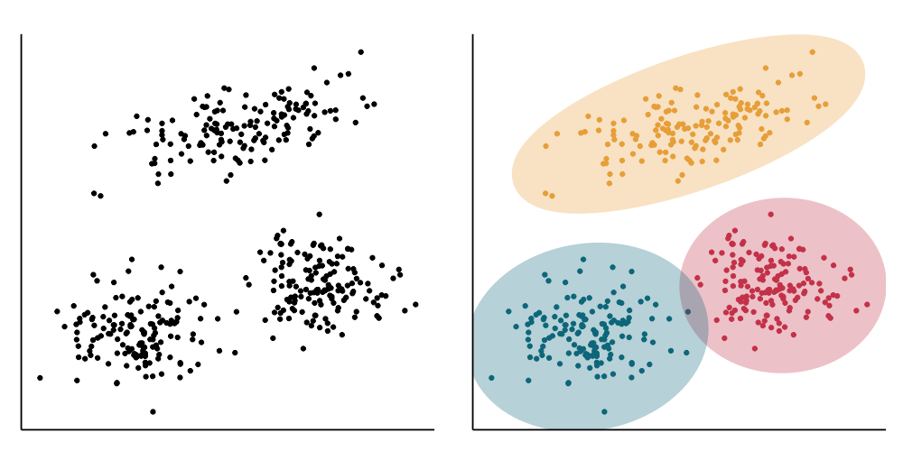

# Classification and Clustering

Those two problems in machine learning are usually taught in separate lectures. However, I find them closely related and that's why I want to introduce them side by side.

Clustering is the process of dividing the set of objects into groups (clusters) in such way that objects in the same group are more similar to each other then to the ojects from other groups.

Here are several examples:

1. Products in the supermarket are organised into sections: bakery, dairy, fruits, vegetables, frozen, meat, cleaning supplies, etc.
2. Movies on Netflix are grouped into categories: Action, Drama, Historical, Horror, etc.
3. Songs on Spotify are grouped by musical styles: Rock'n'Roll, Pop, Jazz, Hip Hop, etc., by mood: Party, Chill, Concentrate, by language: French music, Spanish music, etc.

In machine learning, clustering is a problem of unsupervised learning when you are given the unlabeled dataset and asked to partition the data points into several groups, based on a given similarity metric.

## Clustering VS Classification

Classification and clustering are two problems in machine learning that are easily confused. In both cases, the task is to assign each data point to a group or cluster.

In simple terms, **clustering is unsupervised classification and classification is supervised clustering**.

In practice, however, this means that for classification the number of clusters is defined in advance and every cluster is labeled. For example