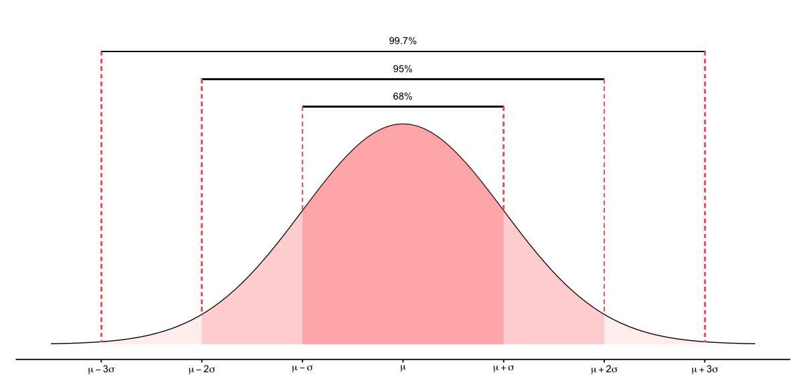

# Univariate and Multivariate Normal Distributions

Data can be distributed in different ways. It can have more values on the left or the right, be symmetrical, or just evenly distributed over some range.

[picture]

The most important probability distribution that fits many natural phenomena (e.g. heights, measurement errors, blood pressure, IQ scores, etc.) is called normal or Gaussian distribution.

The normal distribution is defined by two parameters: mean value $\mu$ and standard deviation $\sigma$. We use the following notation to specify that the random variable $X$ was generated by a process that follows the normal distribution with mean value $\mu$ and standard deviation $\sigma$:

$$
X \sim N(\mu, \sigma)
$$

The probability that a normal distribution $N(\mu, \sigma)$ generates a value $x$ can be calculated using the probability density function (PDF):

$$
f(x) = \frac{1}{\sigma\sqrt{2\pi}}e^{-\frac{1}{2}\big(\frac{x - \mu}{\sigma}\big)^2}
$$

If we plot this function, it looks like a bell and that is why the PDF of a normal distribution is sometimes called the "bell curve".

[picture]

A very important property of a normal distribution is that its mean = median = mode. This means that:

1. The distribution is symmetrical. 50% of data is below the mean value $\mu$ and 50% of values are above it.
2. $\mu$ is the most likely value to be generated by the normal distibution (the PDF reaches its maximum at $\mu$).

Another interesting property of normal distributions is known as [68–95–99.7 rule](https://en.wikipedia.org/wiki/68%E2%80%9395%E2%80%9399.7_rule). It states that for a data that was generated by a process that follows a normal distribution, approximately 68% of values will lie within one standard deviation from the mean $(\mu \pm \sigma)$, 95% of values will be withing two standard deviations from the mean $(\mu \pm 2\sigma)$, and 99.7% of values will be withing three standard deviations from the mean $(\mu \pm 3\sigma)$.



## Multivariate Normal Distribution

$$
\mu = \begin{pmatrix}
1 \\ 0
\end{pmatrix},\quad
\Sigma = \begin{pmatrix}
1 & 0.8 \\
0.8 & 1
\end{pmatrix}
$$

$$
X \sim N(\mu, \Sigma)
$$

## Normal Distributions in Pharo

To work with normal distributions in [Pharo](), we can use the [PolyMath]() library, which provides support for various probability distributions, including the univariate and multivariate normal distributions.

```Smalltalk
mu := #(1 0) asPMVector.

sigma := PMMatrix rows: #(
	(0.5 1)
	(1 3)).
```