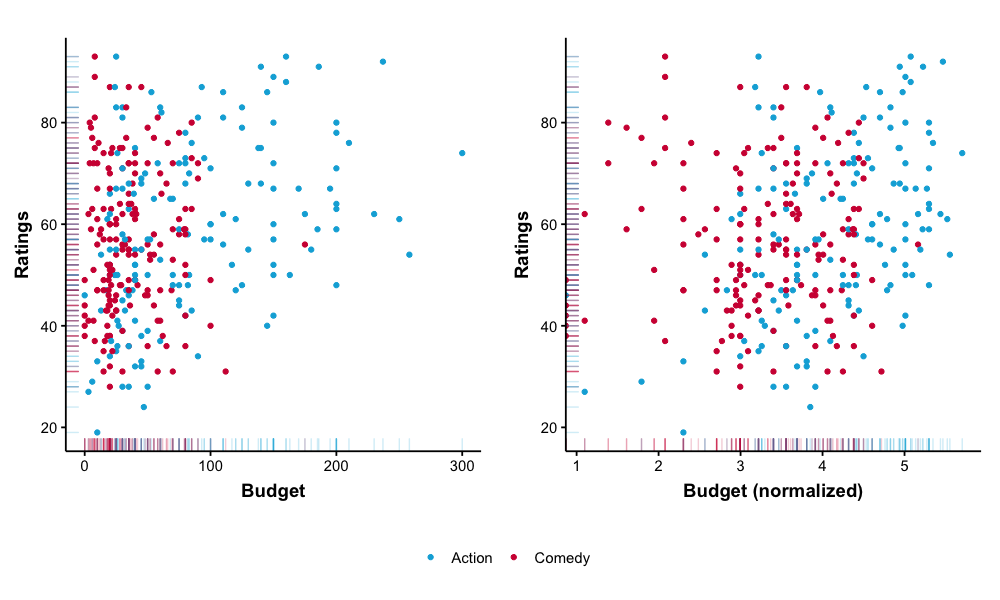

# Data Normalization in Machine Learning

Data comes to us in a dirty state. Some values are missing, some entries are inconsistent with each other. Before applying a machine learning algorithm to a given dataset, we must often perform several preprocessing steps to ensure that the data is clean and in good shape.

In this blog post, I will introduce you to the concept of  _normalization_ -- a very important step of data preprocessing that is crytical when applying certain machine learning algorithms. 

## What Is Normalization?

In statistics and machine learning, _normalization_ is the process which transforms multiple columns of a dataset to make them numerically consistent with each other (e.g. be on the same scale) but in the same time preserve the valuable information stored in these columns.

To better understand why we need to normalize certain columns of a dataset, consider the following examples.

### Example 1. Academic Salaries

The [Salaries]() table which is part of the [carData](https://cran.r-project.org/web/packages/carData/index.html) collection of datasets (Datasets to Accompany J. Fox and S. Weisberg, An R Companion to Applied Regression, Third Edition, Sage, 2019) descibes the 2008-09 nine-month academic salary for Assistant Professors, Associate Professors, and Professors in a college in the U.S.

In this example, we will only work with the following three columns of the dataset:

| Column name | Values |
|---|---|
| Rank | _"Associate Professor"_, _"Assistant Professor"_, or _"Professor"_ |
| Years Since PhD | Integer in range [1 .. 56] |
| Salary | Integer in range [57,800 .. 231,545] |

As you can see, the values of the second and the third column are on a very different scale. The _"Salary"_ column contains much larger numbers that variate on a larger range than the ones from _"Years Since PhD"_ column. Many machine learning algorithms (for example those that calculate distances between data points, such as k-means, k nearest neighbours, support vector machines, etc.) will give higher importance to the columns with larger values. For those algorithms, 10 years of experience will have as little importance as $10 increase in salary, as a result, the _"Years Since PhD"_ column will be practically ignored. You can see this problem visualized in the left part of the figure below.

A common solution is to normalize both _"Salary"_ and _"Years Since PhD"_ columns to be on a common scale, for example [0..1]. You can see the result in the right hand side of the figure above. It is easier to spot patterns in a normalized dataset, both for human eye and for a machine learning algorithm.

**Note.** It is important to save the normalization parameters that will allow us to restore the original values of a column (in this example, those parameters are min and max values).

### Example 2. Movie Ratings

Now let us look at the second example that illustrates a different kind of normalization. The [Movie Ratings](https://www.kaggle.com/trpearce/movie-ratings) dataset published at [Kaggle](https://www.kaggle.com) describes 562 movies with the following columns: _Title_, _Genre_, _Rotten Tomatioes Ratings_, _Audience Ratings_, _Budget_, and _Year of Release_. We will select only those movies that belong to _"Action"_ or _"Comedy"_ genre and analyse the data from the following three columns:

| Column name | Values |
|---|---|
| Genre | _"Action"_ or _"Comedy"_ |
| Budget (million $) | Integer in range [0..300] |
| Audience Ratings % | Integer in range [0..100] |

As you can see in the left part of the visualization below, the values of the _Budget_ column are skewed to the left. This may decrease the performance of some algorithms -- make it harder for them to find the optimal solution and require more time to converge. If you work with a dataset like thar, a common approach is to normalize the values of the _Budget_ column by replacing _Budget_ with _log(Budget)_ -- see the visualization on the right.

## Different Types of Normalization

As you have seen in the examples above, there are many different types of normalization. In this section, I will describe some of the most commonly used approaches. You do not need to remember all of them, in fact, most textbooks describe only the first two normalization techniques: _min-max_ and _z-score normalization_. I briefly mention other approaches just to give you a more general idea of what normalization is about.

### Min-max Normalization (Linear Scaling)

The most simple and most commonly used normalization technique is linear scaling also known as [min-max normalization](https://en.wikipedia.org/wiki/Feature_scaling). It transforms the numbers in a column from range $[x_{min}..x_{max}]$ to the unit range $[0..1]$. For every number $x_i$ taken from the column $X = \{ x_i \}_{i=1}^n$, the normalized value $x_i'$ is calculated as:

$$
x_i' = \frac{x_i - x_{min}}{x_{max} - x_{min}}
$$

If you want to transform your numbers to a custom range $[a..b]$, you can use a more general form of linear scaling:

$$
x_i' = \frac{x_i - x_{min}}{x_{max} - x_{min}} (b - a) + a
$$

The major problem with this basic technique is that your are required to know the range of your data in advance. This is OK if you simply have an unlabeled dataset and you want to mine some interesting patterns from it (e.g. identify clusters using the K-means algorithm). However, if you are training your algorithm on a collected dataset with the purpose of later applying it to the new data that comes to you from a business application, those new values may fall out of range of your original data and cause min-max normalization to overflow (e.g. you identify clusters in your client base and assign new clients to those clusters, or you train a supervised regression model to make predictions based on the new input).

### Z-Score Normalization

Another widely used form of normalization is called [z-score or standard score normalization](https://en.wikipedia.org/wiki/Standard_score). Each number $x_i$ is replaced with a z-score $x_i'$ which is the distance between $x_i$ and the mean of $X$ in the units of standard deviation. In other words, z-score tells us _"how many standard deviations_ $\sigma$ _are there between_ $x_i$ _and the mean value $\mu$"_. 

$$
x_i' = \frac{x_i - \mu}{\sigma}
$$

The mean $\mu$ and standard deviation $\sigma$ are calculated as:

$$
\mu = \frac{1}{n} \sum_{i=1}^n x_i
$$

$$
\sigma = \sqrt{\frac{1}{n-1} \sum_{i=1}^n (x_i - \mu)^2}
$$

This form of normalization overcomes the drawback of min-max technique: you are not required to know the possible range of values in advance. However, unlike min-max which guarantees that the normalized values will be between 0 and 1, the resulting range of z-score values is unknown. That being said, this range will be relatively small. For example, if $X$ follows the [normal distribution](https://en.wikipedia.org/wiki/Normal_distribution) then approximately 95% of normalized values $x_i'$ will fall into the range of $[-2..2]$ (see [68–95–99.7 rule](https://en.wikipedia.org/wiki/68%E2%80%9395%E2%80%9399.7_rule) for explanation).

Another variant of z-score normalization replaces standard deviation $\sigma$ with mean absolute deviation $s_x$ (MAD) calculated as:

$$
s_x = \frac{1}{n} \sum_{i=1}^n | x_i - \mu |
$$

Residuals (deviations from the mean) $|x_i - \mu |$ are not squared like the ones used in standard deviation, which makes mean absolute deviation more robust to outliers.

### Log Scaling

This is the normalization technique that was used in Example 2 which was discussed above. When a handful of values have many data points while most other values have few points, we can use the logarithmic scaling to get a more narrow distribution and improve the performance of some machine learning models.

$$
x_i' = \log(x_i)
$$

### Decimal Scaling

Another simple scaling technique is reducing the values by a smallest power of 10 which ensures that all normalized values are in the range $[-1..1]$:

$$
x_i' = \frac{x_i}{10^j}
$$

where $j$ is the smallest integer such that $ \max(|x_i'|) < 1 $. For example, let's use decimal scaling to normalize the following array of numbers: $X = \{ -100, 250, -300, 500, 974, 100 \}$. In this case, $j=3$ and $10^j=1000$, which gives us $X' = \{ -0.1, 0.25, -0.3, 0.5, 0.974, 0.1 \}$

## Confusing Terminology

As it is with many concepts in machine learning and AI, the terminology that is used to describe normalization is inconsistent accross literature. In some articles, the term _"normalization"_ refers to the min-max technique only and is contrasted with a z-score _"standardization"_. Other articles use the term _"scaling"_ for min-max and reserve _"normalization"_ for z-score.

Perhaps, this confusion comes from the field of statistics, where _"normalization"_ sometimes has other connotations (e.g. transforming data to better fit the normal districution).

I adopt the terminology that is more common in data processing: _"normalization"_ and _"standardization"_ are two terms that can be used interchangeably and encapsulate different techniques such as _"min-max normalization"_ (a.k.a. _"linear scaling"_) and _"z-score normalization"_.

## References

* Jiawei Han, Micheline Kamber, and Jian Pei. _Data Mining. Concepts and Techniques_ (3rd edition). The Morgan Kaufmann Series in Data Management Systems, 2011, pp. 113-115 (Section 3.5.2. Data Transformation by Normalization).
* [Normalization. Machine Learning Crash Course at developers.google.com](https://developers.google.com/machine-learning/data-prep/transform/normalization)
* [Aniruddha Bhandari. _Feature Scaling for Machine Learning: Understanding the Difference Between Normalization vs. Standardization_ -- Analytics Vidhya, April 3, 2020](https://www.analyticsvidhya.com/blog/2020/04/feature-scaling-machine-learning-normalization-standardization/)