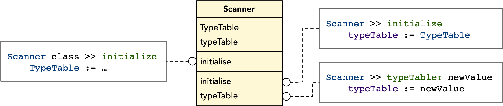

# Design Coffee Club: Shared Pools

Design Coffee Club is a nice initiative that we started at [RMoD](https://rmod.inria.fr).
Once a week, we meet and discuss a topic related to software design.
This week, [Stéphane Ducasse](http://stephane.ducasse.free.fr/) was presenting shared pools in [Pharo](https://pharo.org). In this blog post, I will briefly summarize his lecture.

In Pharo, there are three types of variables that can be shared among different classes:

* **Global Variables** - accessible everywhere.
* **Shared Variables** - accessible both from the class side and the instance side of a class that defines them as well as all of its subclasses.
* **Shared Pools** - groups of shared variables that can be used in different classes that do not need to be in the same hierarchy.

By convention, the names of instance variables and class instance variables in Pharo begin with a lowercase letter. The names of global variables and shared variables begin with an uppercase letter.

## Global Variables

Global variables can be accessed anywhere in Pharo image.
They are stored in the namespace called `Smalltalk` which is implemented as an instance of the class `SystemDictionary`. Every time we access a class in Pharo, we do it through a global variable.

```Smalltalk
Array new.
```

In the example above, `Array` is a global variable associated with an instance of a metaclass `Array class`. When this instance receives a `new` message, it creates new instance of class `Array`.

The list of all global variables in the image can be accessed through `Smalltalk globals` We can use the globals dictinary to create new global variables:

```Smalltalk
Smalltalk globals at: #NewGlobalName put: 42.
```

Or simply by assigning a value to an undeclared variable that starts with a capital letter:

```Smalltalk
NewGlobalVariable := 42.
```

Executing this line anywhere in the image will automatically create a new global variable.

In general, it is not considered a good practice to use global variables in Pharo. When possible, it is recommended to use shared variables or shared pools instead.

## Shared Variables (a.k.a. Class Variables)

A shared variable allows us to share a value among multiple classes of the same hierarchy.
It can be accessed both from class side and the instance side of a class that defines it as well as all of its subclasses.

For example, here is a definition of class color with 4 instance variables (slots, different for every instance) and 11 shared variables (shared by all instances as well as the class itself and all its subclasses).

```Smalltalk
Object << #Color
    slots: { #rgb . #cachedDepth . #cachedBitPattern . #alpha };
    sharedVariables: { #RedShift . #CachedColormaps . #IndexedColors .
        #ComponentMax . #ComponentMask . #ColorRegistry . #GreenShift .
        #BlueShift . #GrayToIndexMap . #HalfComponentMask . #MaskingMap };
    tag: 'Base';
    package: 'Colors'
```

Shared variables can be initialized in the class side `initialize` method.
This method will be evexuted only once when the code is loaded into the memory.
However, it can be executed again manually.

Shared variables of class `Color` from the example above are initialized like this:

```Smalltalk
Color class >> initialize
    ComponentMask := 1023.
    HalfComponentMask := 512.
    ComponentMax := 1023.0.
    RedShift := 20.
    GreenShift := 10.
    BlueShift := 0.
    self initializeColorRegistry.
    self initializeGrayToIndexMap.
    ...
```

Those values are the same for every color in the system.

### Shared Variables VS Class Instance Variables

In the past, shared variables were called class variables.
Because of that, they were often confused with class instance variables.

Class instance variables are shared among all instances of the class but not its subclasses.
For example, we can use a class instance variable `count` to keep track of the number of instances of a given class.
But every subclass will have its own count.

Shared variables are different. They are shared among the subclasses.
This means that if `Count` was implemented as a shared variable, once incremented, it would change for all subclasses.

## Shared Pools

Sometimes we want to share a group of values (usually constant) over multiple hierarchies.
We do not want to repeat the initialization in every hierarchy and create many copies of the same object. 
This can be achieved with a shared pool.

**Shared Pool** is a class that defines and initializes a group of shared variables. It can be added to other classes and they will all get access to the same variables defined by a shared pool.

Here is an example of a shared pool that defines the chronology constants.

```Smalltalk
SharedPool << #ChronologyConstants
    slots: {};
    sharedVariables: { #NanosInSecond . #MonthNames . #SecondsInHour .
        #SecondsInDay . #DayNames . #DaysInMonth . #HoursInDay . #NanosInMillisecond .
        #SecondsInMinute . #SqueakEpoch . #MinutesInHour . #MicrosecondsInDay };
    tag: 'Chronology';
    package: 'Kernel'
```

Each constant is now initialized in the `initialize` method on the class side of `ChronologyConstant`.

```Smalltalk
ChronologyConstants class >> initialize
    "ChronologyConstants initialize"
    SqueakEpoch := 2415386. "Julian day number of 1 Jan 1901"
    SecondsInDay := 86400.
    MicrosecondsInDay := SecondsInDay * 1e6.
    SecondsInHour := 3600.
    SecondsInMinute := 60.
    MinutesInHour := 60.
    HoursInDay := 24.
    NanosInSecond := 10 raisedTo: 9.
    NanosInMillisecond := 10 raisedTo: 6.
    DayNames := #(Sunday Monday Tuesday Wednesday Thursday Friday Saturday).
    MonthNames := #(January February March April May June July August September October November December).
    DaysInMonth := #(31 28 31 30 31 30 31 31 30 31 30 31).
```

This shared pool can now be added to any class in the system.
In the example below, we define a `DateAndTime` class (subclass of `Magnitude`) with four instance variables: `seconds`, `offset`, `julianDayNumber`, and `nanos`, two shared variables: `ClockProvider` and `LocalTimeZoneCache`, as well as a shared pool `ChronologyConstants`.

```Smalltalk
Magnitude << #DateAndTime
    slots: { #seconds . #offset . #julianDayNumber . #nanos };
    sharedVariables: { #ClockProvider . #LocalTimeZoneCache };
    sharedPools: { ChronologyConstants };
    package: 'Kernel'
```

Shared variables defined in a shared pool can now be accessed anywhere in the `DateAndTime ` class, just like its own shared variables.
In the method below, `SecondsInDay` is a shared variable that is defined by the `ChronologyConstants` shared pool.

```Smalltalk
DateAndTime >> secondsSinceMidnightLocalTime
    ^ self localSeconds \\ SecondsInDay
```

One very common use case for shared pools is C library binding through FFI.
In this case, we often have to define many constants for numbers and special types (`uint16`, `STH_float64`, etc.) that will be shared by all classes of the project.
It is very handy to define those constants in a single project-wide shared pool and use it in every class.
 
### Why shared pools should be constant?

Even though it is possible, it is not considered a good practice to use shared pools with variables that can change.
Shared pools can be used anywhere in the system.
If we modify a variable in a shared poo, this change will be applied globally and this can lead to unexpected behavior in different locations.

## Design Pattern: Sharing with Instances

**Problem:** Shared variables can not be substituted without changing the source code or modifying their values (something that should not be done). This makes it hard to test the code that is using a shared variable. Especially if the variable contains a large amount of data, database connection, network connection, etc. This raises a question: _How can we use a shared variable by default but also substitute it with an instance variable if needed?_

**Solution:** We can create an instance variable with the same name as the shared variable. In the `initialize` method (acts like a constructor in Pharo), we assign the default value to the instance variable - the value of a shared variable. Outside the `initialize` method, we never access the shared variable itself but only the instance variable (which points to the same object by default). We also provide a setter for the instance variable which allows us to change its value if needed.

The figure below shows an example of a `Scanner` class that has one shared variable `TypeTable`. This variable is initialized in the class side `initialize` method. This table can be very big and take a lot of memory but it will only be created once, when the code is loaded in the image. In the instance side `initialize` method, the reference to the shared variable `TypeTable` is assigned to the instance variable `typeTable`. After this, the shared variable is never accessed directly in the `Scanner` class. All other methods use the `typeTable` instance variable. This allows us to test the `Scanner` class independently of a type table by using a setter `typeTable:` to substitute the real table (stored in a shred variable) with a fake object (e.g., a mock table).



## References

* [Pharo by Example](https://books.pharo.org/updated-pharo-by-example/pdf/2018-09-29-UpdatedPharoByExample.pdf). Chapter 6.9. Shared Variables