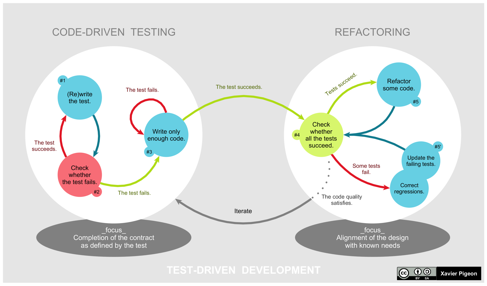

# A Guided Example of Test-Driven Development

In this post, I will explain the principles of Test-Driven Development and demonstrate their application through a simple guided example.
This technique is important for implementing software in a step-by-step manner.
It can be used to contribute to large complex projects and to build small simple projects.

## The Principles of TDD



1. Add a test
2. Run all tests. The new test should fail for expected reasons
3. Write the simplest code that passes the new test
4. All tests should now pass
5. Refactor as needed, using tests after each refactor to ensure that functionality is preserved

## Step 1. Implementing the HPBook class

```st
TestCase << #HPBookTest
	slots: {};
	package: 'HarryPotterKata-Tests'
```
```st
HPBookTest >> testTitle
	| title book |
	title := 'Harry Potter and the Philosopher''s Stone'.
	book := HPBook title: title.
	self assert: book title equals: title.
```
```st
Object << #HPBook
	slots: { #title };
	package: 'HarryPotterKata'
```
```st
HPBook >> title
	^ title
	
HPBook >> title: aString 
	title := aString
```
```st
HPBook class >> title: aString 
	^ self new
		title: aString;
		yourself 
```

## Implementing the HBSeller class

```st
TestCase << #HPSellerTest
	slots: {};
	package: 'HarryPotterKata-Tests'
```
```st
HPSellerTest >> testPriceOfOneBook
	| book seller books expectedPrice sellerPrice |
	
	book := HPBook title: 'Harry Potter and the Chamber of Secrets'.
	seller := HPSeller new.
	
	books := { book }.
	
	expectedPrice := 8.
	sellerPrice := seller priceOf: books.
	
	self assert: sellerPrice equals: expectedPrice.
```
```st
Object << #HPSeller
	slots: { #discountMapping };
	package: 'HarryPotterKata'
```
```st
HPSeller >> initialize
	super initialize.
	discountMapping := #(1 0.95 0.9 0.8 0.75).
```
```st
HPSeller >> basePriceOfOneBook
	"Price of one book without discounts.
	In our example, all books cost 8 euros"
	^ 8
```
```st
HPSeller >> discountForSet: aSet
	^ discountMapping at: aSet size.
```
```st
HPSeller >> priceOfSet: aSet
	| basePrice discount |
	basePrice := self basePriceOfOneBook * aSet size.
	discount := self discountForSet: aSet.
	
	^ basePrice * discount.
```
```st
HPSeller >> priceOf: aCollection 
	| sets |
	sets := self allSetsOfBooks: aCollection.
	
	^ sets inject: 0 into: [ :sum :set |
		sum + (self priceOfSet: set) ]
```

```st
HPSeller >> allSetsOfBooks: aCollection
	| sets set |
	sets := OrderedCollection new.
	
	aCollection do: [ :book |
		set := sets
			detect: [ :each | (each includes: book title) not ]
			ifNone: [ sets add: Set new ].
			
		set add: book title ].
	
	^ sets
```

```st
HPSeller >> priceOf: aCollection 
	| counts price |
	
	counts := aCollection asBag valuesAndCounts values.
	price := 0.
	
	[ counts isEmpty ] whileFalse: [
		min := counts min.
		
		discount := discountMapping at: counts size.
		price := price + (min * counts size * self basePriceOfOneBook * discount).
		
		counts := counts
			collect: [ :each | each - min ]
			thenReject: [ :each | each = 0 ] ].
	
	^ price
```
```st
setUp
	super setUp.
	
	book1 := HPBook title: 'Harry Potter and the Philosopher''s Stone'.
	book2 := HPBook title: 'Harry Potter and the Chamber of Secrets'.
	book3 := HPBook title: 'Harry Potter and the Prisoner of Azkaban'.
	book4 := HPBook title: 'Harry Potter and the Goblet of Fire'.
	book5 := HPBook title: 'Harry Potter and the Order of Phoenix'.
```